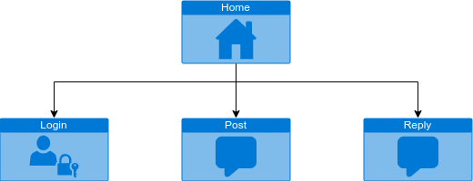
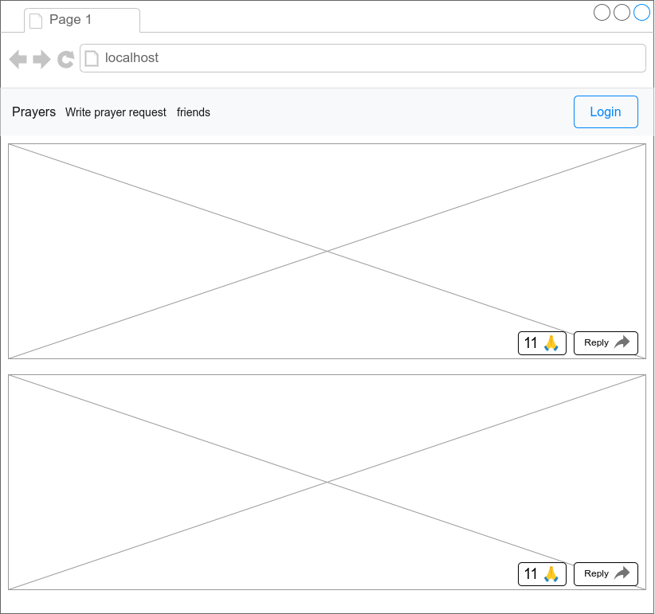

# CST-391 Milestone
[https://github.com/ktbloomq/CST-391-milestone](https://github.com/ktbloomq/CST-391-milestone)

Prayers social platform 
## Introduction
My proposed app will be a public prayer request app. This app will let users send and receive prayer requests. When they post, they can decide weather or not to post anonymously. These prayers can be seen through a public feed and a friends feed. When users pray over that person, they can mark as prayed, or leave a reply.

## Functionality Requirements
1. As a user, I want to post prayers so I can be supported by others
2. As a user, I want the option to post anonymously so I can feel safer to share
3. As a user, I want to see prayer requests so I can pray for others
4. As a user, I want to respond to prayer requests so I can encourage them
5. As a user, I want to be able to log in so I can keep track of my prayers and responses.
6. As a user, I want to add my friends so I can be a constant support for them.

## Initial Database Design

## Initial UI Sitemap

## Initial UI Wireframes

## Risks
The primary risk of this app will be security. Especially, making sure users who wish to stay anonymous. There are countless numbers of people tangled up in messy situations. Having a secure and anonymous platform, they can share their struggles without risking their safety.